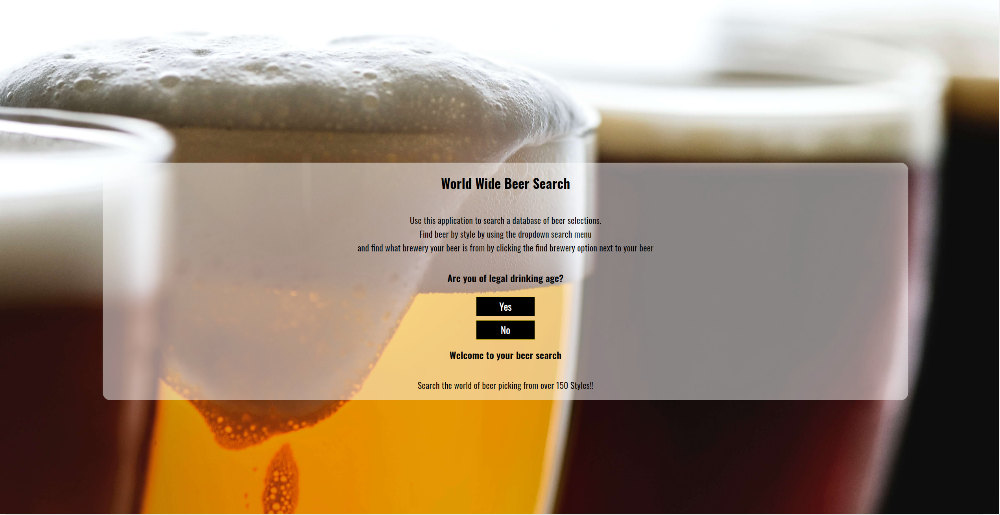
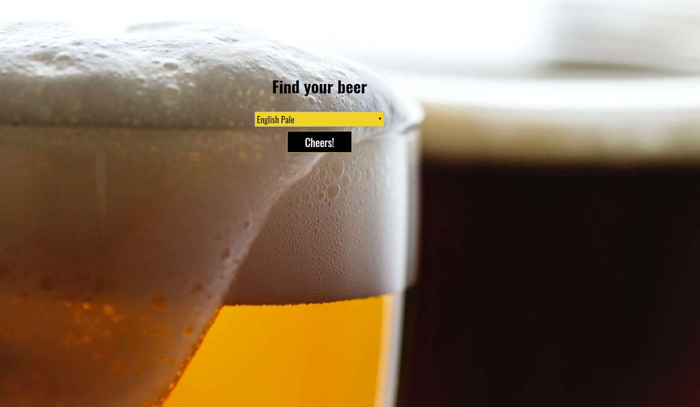
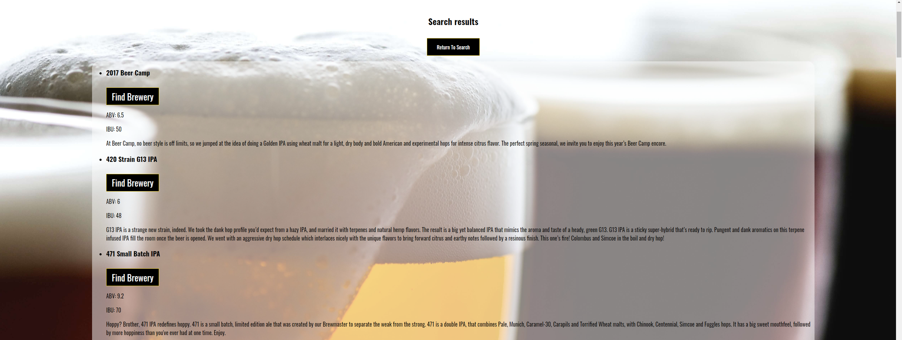

# beersearchapp
Live App: https://jonostarsmore.github.io/beersearchapp/

Initial Landing page/age verification:

Dropdown search menu screen:

Results list after search:

This application is designed to allow users to search a large database of beer from around the world by style. After searching the desired style you are presented with a list of corresponding beers and a feature that allows you to find out which brewery made the beer.

Technologies used were HTML, CSS, JavaScript, and Jqeury
